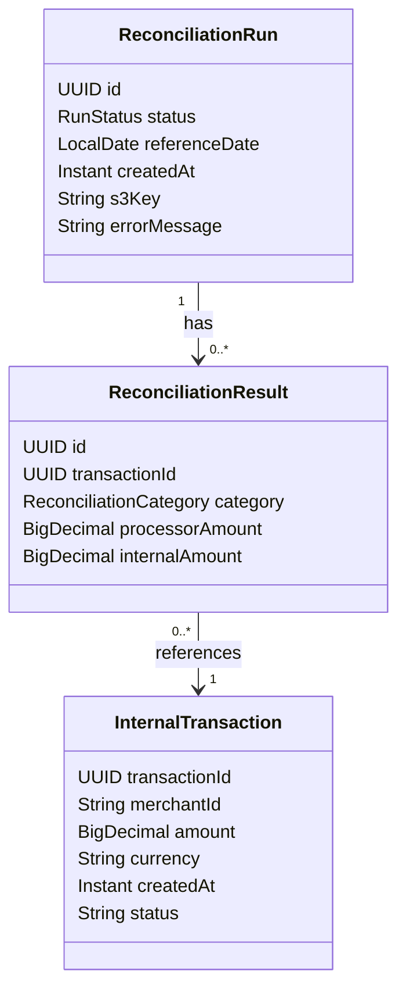

# PRD 0002 — Kafka Consumer: Processamento Assíncrono da Reconciliação

## Problema

Após o upload do CSV e publicação do evento no Kafka (PRD 0001), o sistema precisa consumir esse evento, processar o arquivo e persistir os resultados da reconciliação. Sem isso, o run fica em `PENDING` indefinidamente e nenhuma discrepância é identificada.

## O que será construído

Um consumer Kafka que escuta o tópico `settlement.reconciliation.requested`, faz download do CSV do S3, reconcilia as transações do processador contra as transações internas (dentro da janela de 7 dias da `referenceDate`), persiste os resultados por categoria e atualiza o status do run para `COMPLETED` ou `FAILED`.

Como bônus: se mais de 5% das transações forem `MISMATCHED` ou `UNRECONCILED`, publica um evento de alerta no tópico `settlement.reconciliation.events`.

## Requisitos

1. O consumer escuta o tópico `settlement.reconciliation.requested` e recebe o `runId` como payload.
2. Ao receber o evento, busca o `ReconciliationRun` pelo `runId` e atualiza o status para `PROCESSING`.
3. Faz download do CSV do S3 usando a `s3Key` armazenada no run.
4. Processa o CSV via streaming — linha por linha, sem carregar o arquivo inteiro em memória.
5. Linhas com o mesmo `transaction_id` no CSV são deduplicadas — apenas a primeira ocorrência é processada.
6. O matching é feito exclusivamente pelo `transaction_id`. Cada linha do CSV é classificada em uma das categorias:
   - `MATCHED` — `transaction_id` existe internamente e a diferença de valor é ≤ R$ 0,01
   - `MISMATCHED` — `transaction_id` existe internamente mas a diferença de valor é > R$ 0,01
   - `UNRECONCILED_PROCESSOR` — `transaction_id` não existe nos registros internos
   - `UNRECONCILED_INTERNAL` — transação interna dentro da janela de 7 dias que não apareceu no CSV
7. A janela de 7 dias para `UNRECONCILED_INTERNAL` é `[referenceDate - 7 dias, referenceDate]` (inclusiva), aplicada sobre o `createdAt` das transações internas.
8. Transações internas fora dessa janela não são consideradas `UNRECONCILED_INTERNAL`.
9. Todos os resultados são persistidos em batch na tabela `reconciliation_results`.
10. Ao final do processamento, o status do run é atualizado para `COMPLETED`.
11. Em caso de qualquer falha durante o processamento: rollback completo dos resultados, status do run atualizado para `FAILED` com `error_message` descrevendo a causa.
12. **Bônus:** se a proporção de `MISMATCHED` + `UNRECONCILED` (processor e internal) for > 5% do total de transações do run, publica evento no tópico `settlement.reconciliation.events`.

## Modelo de dados

## Componentes

**Novos:**
- **`ReconciliationConsumer`** — listener Kafka; recebe `runId`, delega ao use case, trata exceções
- **`ProcessReconciliationUseCase`** — orquestra o fluxo completo: download, parsing, matching, persistência, atualização de status
- **`ReconciliationCsvParser`** — lê o CSV via streaming, deduplica por `transaction_id`, emite linhas como sequência
- **`ReconciliationMatcher`** — lógica de matching: recebe linha do CSV + mapa de transações internas, retorna categoria e valores
- **`ReconciliationResultRepository`** — Spring Data JPA para persistência dos resultados em batch
- **`AlertEventPublisher`** — publica evento no tópico `settlement.reconciliation.events` quando threshold de 5% é excedido
- **`ReconciliationResult`** — entidade JPA com `@ManyToOne` para `ReconciliationRun`
- **`ReconciliationCategory`** — enum com `MATCHED`, `MISMATCHED`, `UNRECONCILED_PROCESSOR`, `UNRECONCILED_INTERNAL`
- **Liquibase migration** — cria `reconciliation_results` e adiciona `error_message` em `reconciliation_runs`

**Modificados:**
- **`ReconciliationRun`** — adiciona campo `errorMessage` nullable
- **`RunStatus`** — já contém `PROCESSING`, `COMPLETED`, `FAILED` — sem alteração

## Decisões de implementação

**Consumer Kafka:**
O consumer recebe apenas o `runId` como payload (string). Toda informação necessária (`s3Key`, `referenceDate`) é buscada do banco pelo `runId`. Isso mantém o evento simples e o consumer desacoplado do contrato do producer.

**Streaming do CSV:**
Download e parsing do S3 são feitos via `InputStream` — sem buffer completo em memória. Necessário para suportar arquivos de até 500k linhas (Black Friday).

**Deduplicação:**
Feita durante o parsing — mantém a primeira ocorrência de cada `transaction_id`, descarta as demais. Simples e previsível.

**Carregamento das transações internas:**
As transações internas da janela de 7 dias são carregadas em memória uma única vez (antes de iterar o CSV) e indexadas por `transaction_id` em um `Map`. Isso evita uma query por linha do CSV.

**Matching:**
Matching por `transaction_id` exclusivamente. Tolerância de R$ 0,01 (`BigDecimal` com `abs(processor - internal) <= 0.01`). Status da transação não é comparado — não está no escopo.

**Persistência dos resultados:**
Batch insert — os resultados são acumulados e persistidos em lotes para evitar N+1 de inserts com arquivos grandes.

**Transação:**
Todo o processamento (resultados + atualização de status) roda em uma única transação. Falha em qualquer ponto → rollback completo → run marcado como `FAILED` com `error_message` em transação separada.

**Schema da tabela `reconciliation_results`:**

| Coluna | Tipo | Observação |
|---|---|---|
| `id` | UUID | PK |
| `run_id` | UUID | FK para `reconciliation_runs` |
| `transaction_id` | UUID | ID da transação (sem FK para `internal_transactions`) |
| `category` | VARCHAR(30) | `MATCHED`, `MISMATCHED`, `UNRECONCILED_PROCESSOR`, `UNRECONCILED_INTERNAL` |
| `processor_amount` | DECIMAL | Nulo para `UNRECONCILED_INTERNAL` |
| `internal_amount` | DECIMAL | Nulo para `UNRECONCILED_PROCESSOR` |

**Alteração em `reconciliation_runs`:**

| Coluna | Tipo | Observação |
|---|---|---|
| `error_message` | VARCHAR(1000) | Nullable — preenchido apenas em `FAILED` |

**`transaction_id` sem FK explícita:**
Para `UNRECONCILED_PROCESSOR` não existe transação interna correspondente — uma FK para `internal_transactions` seria sempre nullable, perdendo a garantia de integridade. A integridade é responsabilidade da aplicação.

**Bônus — alerta:**
Calculado ao final do processamento, antes de marcar `COMPLETED`. Threshold: `(mismatched + unreconciled_processor + unreconciled_internal) / total > 0.05`. Publicado no tópico `settlement.reconciliation.events` com `runId` e percentual.

## Decisões de teste

**Unitários:**
- `ReconciliationMatcher` — cobrir todas as categorias, boundary da tolerância (R$ 0,01 exato = matched, R$ 0,02 = mismatched), casos com `processor_amount` e `internal_amount` nulos
- `ReconciliationCsvParser` — parsing correto, deduplicação, linha malformada
- `ProcessReconciliationUseCase` — fluxo completo mockado: happy path, falha no download, falha na persistência, cálculo do threshold de alerta

**Integração:**
- Happy path completo: evento Kafka → CSV processado → resultados persistidos → run `COMPLETED`
- Falha no processamento → run `FAILED` com `error_message` → sem resultados no banco
- Usar H2 para persistência, mock para S3 e Kafka

## Fora do escopo

- Retry automático em caso de falha (o run fica `FAILED` e o operador resubmete)
- Reprocessamento de um run já `COMPLETED`
- Comparação de status entre processador e sistema interno
- Paginação dos resultados (coberta no PRD do `GET /results`)

## Notas

- Transações internas são seedadas via Liquibase com `context="dev"` — disponíveis localmente para testes manuais
- O CSV de exemplo em `requests.http` pode ser usado para disparar o fluxo completo manualmente
- O bônus de alerta deve ser implementado se houver tempo — não é bloqueante para a feature principal
